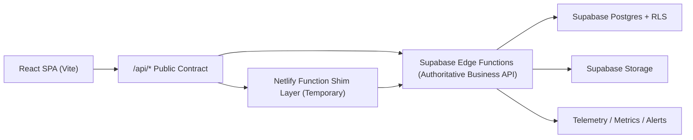
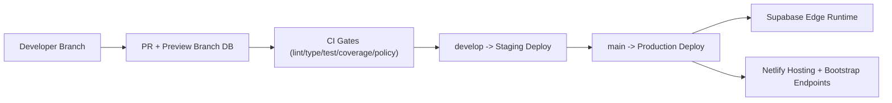

# New Engineer Architecture Pack

## Day-1 Onboarding Flow
1. Install dependencies and verify secrets:
   - `npm ci`
   - `npm run ci:secrets`
2. Validate runtime bootstrap:
   - `npm run contract:runtime-config`
3. Run local quality baseline:
   - `npm run lint`
   - `npm run typecheck`
   - `npm run test:ci`
4. Validate preview smoke path:
   - `npm run preview:build`
   - `npm run preview:smoke`
5. Read source-of-truth references:
   - `docs/api/API_AUTHORITY_CONTRACT.md`
   - `docs/api/ENDPOINT_OWNERSHIP_MATRIX.md`
   - `docs/migrations/MIGRATION_GOVERNANCE.md`
   - `docs/TESTING.md`

## System Diagram

## Deployment Map

## Ownership and Update Policy
- Owner group: **Platform Engineering**.
- Required update triggers:
  - API boundary change (new endpoint or runtime ownership change),
  - migration governance/rules update,
  - deployment topology change,
  - reliability policy threshold change.
- Expected cadence:
  - validate and refresh this pack at every release candidate.

