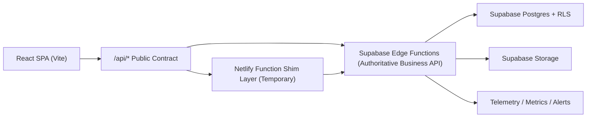
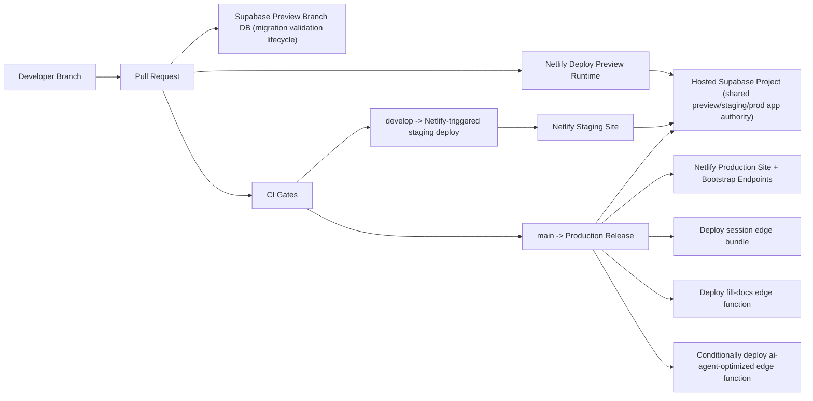

# New Engineer Architecture Pack

## Day-1 Onboarding Flow
1. Install dependencies and verify secrets:
   - `npm ci`
   - `npm run ci:secrets`
2. Validate runtime bootstrap:
   - `npm run contract:runtime-config`
3. Run local quality baseline:
   - `npm run lint`
   - `npm run typecheck`
   - `npm run test:ci`
4. Validate preview smoke path:
   - `npm run preview:build`
   - `npm run preview:smoke`
5. Read source-of-truth references:
   - `docs/api/API_AUTHORITY_CONTRACT.md`
   - `docs/api/ENDPOINT_OWNERSHIP_MATRIX.md`
   - `docs/migrations/MIGRATION_GOVERNANCE.md`
   - `docs/TESTING.md`

## System Diagram

```mermaid
flowchart LR
  UI["React SPA (Vite)"] --> API["/api/* Public Contract"]
  API --> NL["Netlify Function Shim Layer (Temporary)"]
  API --> EDGE["Supabase Edge Functions (Authoritative Business API)"]
  EDGE --> DB["Supabase Postgres + RLS"]
  EDGE --> ST["Supabase Storage"]
  EDGE --> OBS["Telemetry / Metrics / Alerts"]
  NL --> EDGE
```

## Deployment Map

```mermaid
flowchart LR
  DEV["Developer Branch"] --> PR["Pull Request"]
  PR --> NET_PREVIEW["Netlify Deploy Preview Runtime"]
  PR --> PREVIEW["Supabase Preview Branch DB (migration validation lifecycle)"]
  PR --> CI["CI Gates"]
  NET_PREVIEW --> HOSTED["Hosted Supabase Project (shared preview/staging/prod app authority)"]
  CI --> STAGE["develop -> Netlify-triggered staging deploy"]
  STAGE --> NET_STAGE["Netlify Staging Site"]
  NET_STAGE --> HOSTED
  CI --> MAIN["main -> Production Release"]
  MAIN --> HOSTED
  MAIN --> NET["Netlify Production Site + Bootstrap Endpoints"]
  MAIN --> EDGE["Deploy session edge bundle"]
  MAIN --> FILL["Deploy fill-docs edge function"]
  MAIN --> AI["Conditionally deploy ai-agent-optimized edge function"]
```

- Pull requests produce a Netlify deploy preview runtime that, per `docs/ENVIRONMENT_MATRIX.md`, still uses the shared hosted Supabase project for app traffic; that deploy preview is not automatically rebound to a Supabase preview branch database.
- Supabase preview branch databases remain part of the migration-validation lifecycle documented in `docs/supabase_branching.md`. They are ephemeral PR-scoped database sandboxes for branch validation or manual local binding when needed.
- `develop` and staging continue to use Netlify staging backed by the same hosted Supabase project; there is no dedicated staging database.
- On `main`, CI fans out beyond Netlify hosting: it deploys the session edge bundle, deploys `fill-docs` separately, and deploys `ai-agent-optimized` only when the guarded change-scope output marks that surface as changed.

## Ownership and Update Policy
- Owner group: **Platform Engineering**.
- Required update triggers:
  - API boundary change (new endpoint or runtime ownership change),
  - migration governance/rules update,
  - deployment topology change,
  - reliability policy threshold change.
- Expected cadence:
  - validate and refresh this pack at every release candidate.

