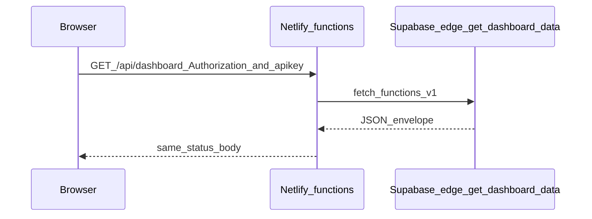

# Netlify / Supabase parity for dashboard API

Operations runbook: keep **Netlify** (production and staging) environment variables aligned with the **canonical** hosted Supabase project so **`GET /api/dashboard`** and **`GET /api/runtime-config`** stay healthy.

## Canonical project

| Field | Value |
|--------|--------|
| Project ref | `wnnjeqheqxxyrgsjmygy` |
| API URL | `https://wnnjeqheqxxyrgsjmygy.supabase.co` |

See also [Environment matrix](../ENVIRONMENT_MATRIX.md) and [Admin test accounts](../supabase/ADMIN_TEST_ACCOUNTS.md).

Do **not** paste anon keys, service-role keys, or `.env` contents into tickets or this repo. Use the Supabase Dashboard (**Settings → API**) and your secrets store (e.g. 1Password).

## Why parity matters

1. **Runtime config** — The browser bootstraps Supabase via **`GET /api/runtime-config`**, implemented in [`src/server/api/runtime-config.ts`](../../src/server/api/runtime-config.ts) using [`src/server/runtimeConfig.ts`](../../src/server/runtimeConfig.ts). That handler reads **`SUPABASE_URL`** and the resolved publishable/anon key from **Netlify server env**.

2. **Dashboard proxy** — **`GET /api/dashboard`** is served by a Netlify function ([`netlify/functions/dashboard.ts`](../../netlify/functions/dashboard.ts)) that runs [`src/server/api/dashboard.ts`](../../src/server/api/dashboard.ts). It forwards to the Edge function `get-dashboard-data` via [`proxyToEdgeAuthority`](../../src/server/api/edgeAuthority.ts). The outbound URL comes from **`SUPABASE_URL`** / optional **`SUPABASE_EDGE_URL`**; the **`apikey`** sent upstream is taken from the **incoming request** if present, otherwise from server env ([`resolveRuntimeAnonKey`](../../src/server/api/edgeAuthority.ts)).

3. **Client behavior** — The SPA calls `callApi('/api/dashboard', …)` with a refreshed JWT and may forward **`apikey`** from [`getSupabaseAnonKey()`](../../src/lib/runtimeConfig.ts) after [`ensureRuntimeSupabaseConfig()`](../../src/lib/runtimeConfig.ts) ([`src/lib/optimizedQueries.ts`](../../src/lib/optimizedQueries.ts)). That **reduces** failures when Netlify env drifts, but **operators should still** keep server env correct for other callers and defense in depth.

## Preconditions

- Netlify site is linked to this repository.
- Access to **Site configuration → Environment variables** for **Production** and **Staging** (or the deploy context you use).
- Access to Supabase project **`wnnjeqheqxxyrgsjmygy`** (Dashboard → Settings → API) to compare **URL** and **anon / publishable** key **shapes** (not to copy keys into chat).

## Variables to verify (names only)

Set values from Supabase **Settings → API** for project **`wnnjeqheqxxyrgsjmygy`**.

| Variable | Purpose |
|----------|--------|
| `SUPABASE_URL` | Must be `https://wnnjeqheqxxyrgsjmygy.supabase.co` (no trailing slash issues; server normalizes usage). |
| `SUPABASE_ANON_KEY` or `VITE_SUPABASE_ANON_KEY` | Publishable/anon JWT for the same project. Resolution order is documented in [`src/server/runtimeConfig.ts`](../../src/server/runtimeConfig.ts) and [`src/server/api/edgeAuthority.ts`](../../src/server/api/edgeAuthority.ts) (including publishable-key alias env vars). |
| `SUPABASE_EDGE_URL` or `VITE_SUPABASE_EDGE_URL` | Optional; if unset, edge base is derived from `SUPABASE_URL` + `/functions/v1` ([`getEdgeAuthorityBaseUrl`](../../src/server/api/edgeAuthority.ts)). |
| `DEFAULT_ORGANIZATION_ID` | Required for production runtime config validation; fallbacks exist in code—see [`src/server/runtimeConfig.ts`](../../src/server/runtimeConfig.ts). If missing in production, safe org context can fail ([Environment matrix](../ENVIRONMENT_MATRIX.md)). |

## Verification checklist

1. **Runtime config**
   - After deploy, open the app origin (production or staging).
   - In DevTools **Network**, confirm **`GET /api/runtime-config`** returns **200** and JSON includes **`supabaseUrl`** whose host is **`wnnjeqheqxxyrgsjmygy.supabase.co`**.

2. **Dashboard**
   - Sign in as an admin-capable user.
   - Confirm **`GET /api/dashboard`** returns **200** and the dashboard loads without the “failed to load / fallback” banner.
   - If issues persist, check **Netlify → Functions → dashboard** logs for the same window (no secret values in screenshots).

3. **Parity spot-check**
   - Compare Netlify **`SUPABASE_URL`** string to the project URL above.
   - Confirm anon/publishable key **version** matches what you expect after a rotation (compare in Supabase Dashboard vs 1Password, not in git).

## Failure modes

| Symptom | Likely cause |
|---------|----------------|
| **401** on `/api/dashboard` while **`profiles` / `user_roles`** return **200** | Netlify proxy using wrong **`SUPABASE_URL`** or mismatched **anon key** vs the browser’s project; or edge rejects JWT—verify env and clock skew. |
| **403** on dashboard or feature flags with “org” messaging | Missing or wrong **`DEFAULT_ORGANIZATION_ID`** ([Environment matrix](../ENVIRONMENT_MATRIX.md)). |
| **CORS** errors on **`*.supabase.co/functions/v1/...`** from the browser | Prefer same-origin **`/api/dashboard`** for admin dashboard data; direct browser→edge calls require correct CORS on the function and gateway. |
| **500** on `/api/runtime-config` | Server cannot build config—check Netlify env for placeholders or missing required vars ([`src/server/runtimeConfig.ts`](../../src/server/runtimeConfig.ts)). |

## Key rotation

Follow **[Environment matrix – Shared credential rotation](../ENVIRONMENT_MATRIX.md#shared-credential-rotation-staging--production)**. Rotate anon/service keys in Supabase, update 1Password, then **Netlify staging + production** and GitHub Actions secrets together, then redeploy.

## Related code (reference)

| Piece | File |
|--------|------|
| Netlify entry | [`netlify/functions/dashboard.ts`](../../netlify/functions/dashboard.ts) |
| Dashboard handler | [`src/server/api/dashboard.ts`](../../src/server/api/dashboard.ts) |
| Edge proxy | [`src/server/api/edgeAuthority.ts`](../../src/server/api/edgeAuthority.ts) |
| Server runtime config | [`src/server/runtimeConfig.ts`](../../src/server/runtimeConfig.ts) |
| Runtime config HTTP | [`src/server/api/runtime-config.ts`](../../src/server/api/runtime-config.ts) |
| Client dashboard fetch | [`src/lib/optimizedQueries.ts`](../../src/lib/optimizedQueries.ts) |

## Out of scope

- Changing Supabase RLS, migrations, or live database policies (use migration review and DBA process).
- Storing real keys in this repository.
