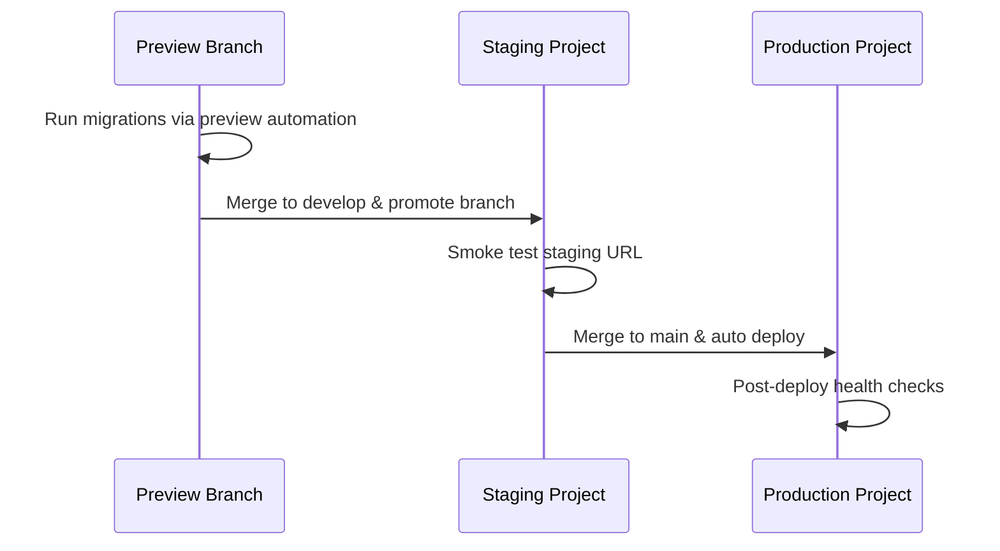

# Supabase Branching Runbook

This runbook documents how Supabase branching works for this repository and how engineers should operate within the workflow that the GitHub integration provisions.

## Overview

Supabase is connected to this GitHub repository with the following settings:

- **Supabase directory:** repository root (`.`)
- **Deploy to production:** enabled for the `main` branch
- **Automatic branching:** enabled with preview branches created for each pull request (limit 50)
- **Supabase changes only:** enabled so migrations under `supabase/migrations/` trigger previews

Every pull request automatically receives an isolated preview database. The integration runs `supabase db push` against that preview using the migrations committed in the branch. When the pull request is merged or closed, the preview branch and database are deleted by Supabase.

> ⚠️ Preview databases are billed resources. Treat them as ephemeral sandboxes—never rely on them for long-term storage.

## Preview Database Lifecycle

1. **PR opened:** Supabase detects the branch, provisions a preview project, and seeds it with the migrations in the branch.
2. **Updates pushed:** new migrations in the pull request are applied automatically to the preview database. Keep migrations additive to avoid destructive data loss between pushes.
3. **PR merged or closed:** Supabase destroys the preview project (database, auth, storage). Capture any data you need before closing.

If a preview project fails to provision, check the Supabase dashboard activity feed and ensure the migrations run with `supabase db push` locally before retrying.

## Testing Against a Preview Database

1. In the Supabase dashboard, open the pull request’s preview project and copy the generated API keys (`SUPABASE_URL`, `SUPABASE_ANON_KEY`, and `SUPABASE_SERVICE_ROLE_KEY`).
2. Create a `.env` file based on `.env.example` and populate the values for the preview project.
3. Run local checks:
   ```bash
   npm install
   npm run lint
   npm run typecheck
   npm test
   ```
   Tests that need database access will consume the preview credentials.
4. When pairing with frontend changes, point the Vite dev server to the preview credentials by exporting `VITE_SUPABASE_URL` and `VITE_SUPABASE_ANON_KEY` in your shell (do **not** expose the service role key to client-side bundles).

## Migration Workflow

- Place all SQL migrations in `supabase/migrations/`. Filenames must be timestamped (UTC) to preserve ordering.
- Generate migrations using `supabase db diff --use-migrations` or `supabase migration new` to ensure idempotent, additive scripts.
- Avoid destructive operations (`DROP TABLE`, `DROP COLUMN`) unless wrapped in safe guards (e.g., `IF EXISTS`, concurrent index creation). Coordinate any breaking change with the backend lead and document mitigation steps in the pull request.
- Before opening a PR, run `supabase db lint` or `supabase db push --dry-run` locally to validate the migration set.

### Promoting to Staging (`develop`)

We currently run all environments (preview, staging, production) against the same hosted Supabase project `wnnjeqheqxxyrgsjmygy`. There is no dedicated staging database. Instead, we:

1. Merge approved changes into the `develop` branch once preview smoke tests succeed (Netlify staging deploy kicks off automatically).
2. If you need an isolated database before promoting, create a Supabase **branch** via `npm run db:branch:create <name>` or `supabase branches create <name> --project-ref wnnjeqheqxxyrgsjmygy`. Apply migrations there with `supabase db push --project-ref <branch-id>`.
3. When ready, apply migrations to the hosted project using the Supabase dashboard (**Promote branch** → select your preview) or the CLI:
   ```bash
   supabase db push --project-ref wnnjeqheqxxyrgsjmygy
   ```
4. Confirm RLS policies/seed scripts ran successfully by executing `supabase db diff --project-ref wnnjeqheqxxyrgsjmygy --schema public --linked`. The diff should be empty.
5. Rotate service-role keys after major schema updates (see [Environment Matrix](./ENVIRONMENT_MATRIX.md)) and update Netlify staging env vars accordingly (mask values as `****`).

### Promoting to Production (`main`)

1. Resolve all review comments and ensure the preview branch tests pass.
2. Merge the PR into `main`. Supabase automatically deploys migrations in `supabase/migrations/` to the production project because “Deploy to production” is enabled for `main`.
3. Monitor the Supabase dashboard deployment logs. If a migration fails, follow the rollback/forward-fix plan documented in the PR.
4. Regenerate generated types (e.g., `npm run typegen`) after production deploys if schema changes affect the application code.

### Migration Promotion Flow Overview



If staging promotion fails, roll back by restoring the previous staging backup (Supabase dashboard → Database Backups) and re-running migrations locally to reproduce the failure before retrying the promotion.

## Troubleshooting

- **Preview project missing:** confirm the branch name matches the PR and that `supabase/config.toml` remains at `supabase/config.toml` in the repository root.
- **Migrations fail to apply:** run `supabase db push --dry-run` locally and inspect the SQL for destructive statements. Adjust to ensure idempotency.
- **Service role leakage:** never embed `SUPABASE_SERVICE_ROLE_KEY` in browser bundles. Restrict usage to server-side code and tests.

Reach out to the platform team if the branch limit of 50 previews is reached or if you need to retain a preview database longer than a PR’s lifetime.
