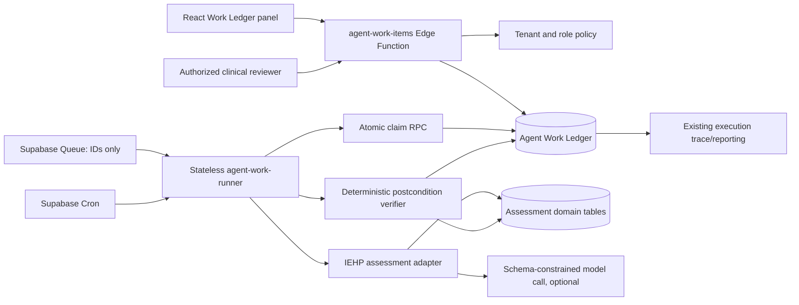

# Goal-Directed Stateful Agent Work Ledger Implementation Plan

> **Historical plan:** This document preserves the original foundation architecture and task sequence. Its unchecked boxes are not current implementation status. Use the [foundation handoff](../../ai/handoffs/agent-work-ledger-foundation.md), [operations runbook](../../ops/agent-work-ledger.md), and later dated plans in this directory for current evidence and rollout state.

> **For agentic workers:** REQUIRED SUB-SKILL: Use superpowers:subagent-driven-development (recommended) or superpowers:executing-plans to implement this plan task-by-task. Steps use checkbox (`- [ ]`) syntax for tracking.

**Goal:** Add a durable, tenant-safe Agent Work Ledger that turns bounded objectives into deterministic, inspectable work graphs, beginning with a shadow-mode IEHP assessment-preparation workflow that cannot autonomously approve, promote, sign, or publish clinical content.

**Architecture:** Keep existing clinical and operational tables as systems of record. Add a provider-neutral Postgres ledger for objectives, workflow-template versions, steps, dependencies, evidence pointers, approvals, attempts, events, leases, and effect idempotency. Supabase Edge Functions own workflow policy and mutations; stateless workers claim one step at a time, derive state from authoritative domain records, and append PHI-free events. The model may produce schema-constrained suggestions, but server-owned templates, policies, evidence checks, and human approvals control transitions and completion.

**Tech Stack:** React 18/Vite/TypeScript, Supabase Postgres/RLS/Edge Functions, Supabase Queues (`pgmq`) and Cron (`pg_cron`/`pg_net`) for the active-worker phase, Vitest/Testing Library, Playwright, existing OpenAI integration and trace tables.

## Global Constraints

- This document is a plan only. Do not implement any task without a new, fresh `route-task` classification for the exact slice.
- The plan-writing task is `classification: low-risk autonomous`, `lane: fast`, because only this documentation file changes.
- Every implementation task is initially `classification: high-risk human-reviewed`, `lane: critical`, because the end-to-end design touches migrations, RLS, Supabase Functions, server boundaries, tenant-sensitive clinical state, and eventually scheduled workers.
- Before implementation, create or confirm a Linear issue, create a `codex/` branch, run `route-task`, define allowed files/non-goals/stop conditions, and obtain the critical-lane human review required by `AGENTS.md` and `docs/ai/cto-lane-contract.md`.
- Use synthetic or redacted assessment fixtures only. Never place PHI, raw prompts containing PHI, model reasoning, source document text, credentials, or signed URLs in ledger events, traces, queue messages, logs, tests, or commits.
- Preserve current assessment upload, extraction, checklist, review, promotion, DOCX, and PDF behavior while ledger mode is `disabled`, `shadow`, or `advisory`.
- The first active objective ends at `needs_review`. It cannot approve clinical work, promote draft records, generate a signature, submit billing, or publish a final packet.
- Do not let a model define tenant scope, tool permissions, approval requirements, workflow completion, retry policy, or the executable graph. Those are versioned server-owned rules.
- Do not use OpenAI conversation/session history, serialized SDK run state, or background mode as the system of record. Those mechanisms may support an attempt, but Postgres owns durable work state.
- Do not migrate `ai-agent-optimized` from Chat Completions to Responses/Agents SDK in the same first slice. Evaluate that separately after the ledger is stable.
- Do not copy the current fail-open database-error behavior of the `ai-agent-optimized` kill-switch lookup into mutating workers. Mutating work must fail closed if runtime policy cannot be read.
- Keep each task reviewable and independently reversible. Stop if a task requires a broader shared/global change than its declared files.

---

## 1. Product Contract

### 1.1 Goal-directed behavior

The platform must distinguish a durable objective from an individual prompt:

- Objective: `Prepare this IEHP assessment for clinical review.`
- Plan: a server-owned, versioned workflow graph chosen by objective type and authoritative domain facts.
- Step: one deterministic, model-assisted, or human action with explicit preconditions and postconditions.
- Evidence: references to authoritative domain records and immutable hashes used to justify a transition.
- Approval: a durable decision by an authorized human over a specific input/evidence hash.
- Attempt: one execution of one step, including provider/model/tool versions, lease, token/cost metadata, and error class.
- Completion: a server-evaluated predicate. A model response cannot directly mark a work item complete.

The stable loop is:

```text
load objective and workflow version
  -> reconcile authoritative facts
  -> find ready step
  -> claim with a lease
  -> execute one bounded action
  -> verify postcondition
  -> append evidence and event
  -> recompute graph status
  -> wait, request human approval, retry, fail, or continue
```

### 1.2 First vertical slice

Create one ledger work item for an IEHP FBA assessment document and project the existing assessment lifecycle into these steps:

1. `validate_scope`: confirm organization, client, payer/template, and assessment-document relationships.
2. `observe_upload`: verify the authoritative `assessment_documents` row exists.
3. `await_extraction`: wait until extraction is complete, or expose a terminal extraction blocker.
4. `validate_review_evidence`: enumerate missing required checklist/structured-section evidence without inventing content.
5. `build_review_readiness`: store a PHI-free readiness snapshot and evidence hashes.
6. `assign_clinical_owner`: require an explicit authorized human owner.
7. `request_clinical_review`: transition the objective to `needs_review`.

Completion criteria for this first objective:

- The linked assessment document belongs to the same organization and client as the work item.
- The template is IEHP FBA and the document is in an extraction-complete state accepted by the existing assessment read model.
- Required review rows/sections are present or are represented as explicit blockers.
- The existing IEHP review read model loads successfully.
- Every readiness claim has an authoritative evidence pointer and hash.
- An authorized clinical owner is assigned.
- The terminal state is `needs_review`, not `completed`, until a later separately approved workflow defines review completion.

### 1.3 Explicit non-goals for the first release

- Autonomous clinical approval, program/goal promotion, signature, payer submission, billing, or final-record publication.
- A general-purpose free-form planner that invents steps at runtime.
- Multi-agent negotiation or agent-to-agent delegation.
- Replacing the assessment domain tables with ledger payloads.
- Rewriting extraction, `generate-program-goals`, IEHP promotion, PDF, or DOCX generation.
- Adding an external workflow platform before the in-database design is measured.

## 2. Architecture Decision

### 2.1 Alternatives considered

| Alternative | Benefit | Cost/risk | Decision |
|---|---|---|---|
| Assessment-only workflow table | Fastest initial delivery | Duplicates orchestration for every future domain and hard-codes one lifecycle | Reject |
| Generic ledger plus deterministic domain adapters | Reusable graph, consistent audit/approval/retry semantics, bounded domain authority | Requires careful schema and adapter contracts | Adopt |
| External durable workflow engine | Mature timers, retries, and replay | New infrastructure, operational ownership, PHI boundary, deployment and incident surface | Defer until measured Postgres limits justify it |

### 2.2 Component boundaries



Authority rules:

- Supabase Edge Functions own business workflow logic. Netlify/server handlers may be transport proxies only, following `docs/api/API_AUTHORITY_CONTRACT.md` and `src/server/api/edgeAuthority.ts`.
- Assessment tables remain authoritative for upload, extraction, checklist, structured sections, review, draft, promotion, and generated output.
- Ledger records store relationships, state, hashes, reason codes, and sanitized metadata. Evidence rows point to allowlisted domain records rather than copying source text.
- Queue messages contain only work-item/step IDs, organization ID, availability time, and correlation ID.
- Workers are disposable and stateless. A lease and state-version compare-and-swap prevent two workers from committing the same transition.
- End-to-end execution is treated as at-least-once even though `pgmq.read` hides a message during its visibility window. Every effect therefore needs its own idempotency key and postcondition check.

### 2.3 Status model

Use closed enums and transition tables, not arbitrary strings.

```ts
export type WorkItemStatus =
  | "queued"
  | "running"
  | "waiting"
  | "needs_review"
  | "blocked"
  | "completed"
  | "failed"
  | "cancelled";

export type WorkStepStatus =
  | "pending"
  | "ready"
  | "running"
  | "waiting"
  | "needs_approval"
  | "completed"
  | "failed"
  | "skipped"
  | "cancelled";

export type WorkExecutionMode = "deterministic" | "model_suggested" | "human";
export type WorkRisk = "low" | "moderate" | "high" | "clinical";
```

Terminal states are immutable except through an explicit, audited reopen operation introduced by a later workflow version. `cancelled` must not be reused as `failed`; `waiting` must include a reason and optional wake time; `blocked` must identify a human-actionable blocker.

### 2.4 Data model

Migration `supabase/migrations/20260801090000_agent_work_ledger_core.sql` creates:

| Table | Required fields and invariants |
|---|---|
| `agent_work_items` | `id`, `organization_id`, nullable `client_id`, nullable `parent_work_item_id`, `workflow_key`, `workflow_version`, `objective`, closed `status`, `risk`, `priority`, nullable `owner_user_id`, nullable `assigned_agent_key`, nullable `due_at`, `completion_criteria jsonb`, nullable `current_step_id`, nullable `prompt_tool_version_id`, `state_version`, `dedupe_key`, timestamps; unique `(organization_id, workflow_key, workflow_version, dedupe_key)` |
| `agent_work_item_dependencies` | predecessor/successor work-item FKs, same-organization constraint, unique edge, no self-edge |
| `agent_work_assessment_links` | `work_item_id`, `organization_id`, `client_id`, `assessment_document_id`; one work item per document/workflow version; real FKs instead of polymorphic subject IDs |
| `agent_work_steps` | work item/org/client, stable `step_key`, ordinal, execution mode, status, risk, required role, completion criteria, input/output hashes, attempt counters, retry ceiling/time, lease owner/expiry, last error code, state version; unique `(work_item_id, step_key)` |
| `agent_work_step_dependencies` | predecessor/successor step FKs, unique edge, no self-edge, same-work-item enforcement |
| `agent_work_evidence` | work item/step/org/client, allowlisted `source_kind`, source UUID, optional locator, SHA-256 content hash, captured time; no raw source content |
| `agent_work_approvals` | work item/step/org/client, required role, `pending/approved/rejected/expired/revoked`, input/evidence hash, requestor/decider, decision reason code, requested/decided/expiry timestamps |
| `agent_work_attempts` | work item/step/org/client, attempt number, worker ID, status, lease timestamps, correlation/request IDs, provider/model, prompt/tool/workflow versions, token counts, pricing version and optional computed cost, error class/code, timestamps |
| `agent_work_effects` | work item/step/attempt/org/client, effect kind, target kind/ID, payload hash, unique effect key, status and verified timestamp; prevents duplicate external/domain mutations |
| `agent_work_events` | append-only work item/step/attempt/org/client, event type, actor kind/ID, correlation/request IDs, sanitized metadata, created time |

Every PHI-related row carries `organization_id` and `client_id` directly so RLS does not depend on an unbounded polymorphic join. Add indexes for organization/status, client/created time, ready/wake time, lease expiry, parent work item, assessment document, and event timeline. Use `ON DELETE RESTRICT` for clinical-domain links and work history; use an explicit retention/export process instead of cascading clinical audit history away.

### 2.5 Security and privacy invariants

- RLS is enabled and forced on every ledger table.
- Authenticated reads require active organization membership. Client-scoped reads also require the existing client/organization access invariant.
- Direct authenticated writes to steps, attempts, effects, evidence, and events are denied. Security-definer RPCs with fixed `search_path` perform validated transitions.
- Approval decisions verify the caller's current `user_roles` membership and required role at decision time; `profiles.role` alone is insufficient.
- Service-role workers repeat organization/client relationship validation before every effect. Service role is not accepted as proof of tenant scope.
- An approval is bound to a canonical input/evidence hash. Any relevant evidence change revokes the approval and returns the step to `needs_approval`.
- Tool selection comes from a server-owned allowlist keyed by workflow/step/risk. Prompt content cannot name or unlock a tool.
- Mutating workers check `AGENT_ACTIONS_DISABLED` and the database runtime mode. Missing/unreadable policy means deny for mutations and allow only sanitized observation.
- Event metadata passes an allowlist sanitizer. Reject keys/values resembling document text, names, email, phone, address, diagnosis, notes, signed URLs, authorization headers, prompts, or model chain-of-thought.
- Traces use IDs, reason codes, counts, hashes, latency, token usage, and outcome only. They do not contain clinical source text.

## 3. Planned File Map

### New files

```text
supabase/migrations/20260801090000_agent_work_ledger_core.sql
supabase/migrations/20260801093000_agent_work_ledger_queue.sql
supabase/migrations/20260801100000_agent_work_ledger_retention.sql
supabase/functions/_shared/agent-work/contracts.ts
supabase/functions/_shared/agent-work/state-machine.ts
supabase/functions/_shared/agent-work/state-machine.test.ts
supabase/functions/_shared/agent-work/policy.ts
supabase/functions/_shared/agent-work/policy.test.ts
supabase/functions/_shared/agent-work/events.ts
supabase/functions/_shared/agent-work/events.test.ts
supabase/functions/_shared/agent-work/repository.ts
supabase/functions/_shared/agent-work/assessment-prep.ts
supabase/functions/_shared/agent-work/assessment-prep.test.ts
supabase/functions/agent-work-items/index.ts
supabase/functions/agent-work-items/function.toml
supabase/functions/agent-work-items/index.test.ts
supabase/functions/agent-work-runner/index.ts
supabase/functions/agent-work-runner/function.toml
supabase/functions/agent-work-runner/index.test.ts
supabase/functions/agent-work-sweeper/index.ts
supabase/functions/agent-work-sweeper/function.toml
supabase/functions/agent-work-sweeper/index.test.ts
src/lib/agent-work-ledger.ts
src/lib/__tests__/agent-work-ledger.test.ts
src/components/agent-work/AssessmentWorkLedgerPanel.tsx
src/components/agent-work/WorkStepTimeline.tsx
src/components/agent-work/WorkBlockers.tsx
src/components/agent-work/WorkApprovalCard.tsx
src/components/agent-work/__tests__/AssessmentWorkLedgerPanel.test.tsx
scripts/agent-work-ledger-security-contract.mjs
scripts/agent-work-ledger-shadow-parity.mjs
scripts/agent-work-ledger-chaos.mjs
docs/ops/agent-work-ledger.md
docs/ai/handoffs/agent-work-ledger-foundation.md
```

### Existing files expected to change

```text
src/lib/generated/database.types.ts
src/components/ClientDetails/IehpFbaLayoutReview.tsx
src/components/__tests__/IehpFbaLayoutReview.test.tsx
src/pages/MonitoringDashboard.tsx
src/pages/__tests__/MonitoringDashboard.test.tsx
supabase/functions/ai-agent-optimized/index.ts
supabase/functions/agent-trace-report/index.ts
supabase/config.toml
package.json
docs/api/API_AUTHORITY_CONTRACT.md
docs/ai/verification-matrix.md
```

`supabase/functions/ai-agent-optimized/index.ts` changes only after the ledger is operational, to accept ledger correlation IDs and enforce tool guardrails. It does not become the runner or ledger owner.

---

## 4. Implementation Tasks

### Task 1: Establish the critical-lane execution envelope

**Files:**
- Create: `docs/ai/handoffs/agent-work-ledger-foundation.md`
- Read: `AGENTS.md`
- Read: `docs/ai/cto-lane-contract.md`
- Read: `docs/ai/high-risk-paths.md`
- Read: `docs/ai/verification-matrix.md`
- Read: `docs/api/API_AUTHORITY_CONTRACT.md`

- [ ] Create or confirm one Linear issue for the bounded foundation plus IEHP shadow adapter. Record subsequent active-worker and mutating phases as separately gated subtasks.
- [ ] Create a new `codex/agent-work-ledger-foundation` branch without modifying the user-owned dirty handoff for WIN-265.
- [ ] Run repo-local `route-task` for only schema + RLS + shared state machine + IEHP shadow adapter. Record `classification`, `lane`, triggering paths, required specialists, and required checks.
- [ ] Define allowed files from Tasks 2-5, non-goals from Section 1.3, and stop conditions for auth, promotion, billing, deploy, or clinical-completion scope widening.
- [ ] Obtain specification-engineer acceptance criteria and software-architect, security-engineer, supabase-reviewer, test-engineer, and code-review-engineer review assignments required by the critical lane.
- [ ] Commit only the tracking artifact after route-task approves the slice.

Expected route result:

```text
classification: high-risk human-reviewed
lane: critical
triggering paths: supabase/migrations/**, supabase/functions/**, tenant-sensitive clinical workflow state
human review: required before merge
```

**Verification:** manually confirm the handoff contains scope, non-goals, stop conditions, reviewers, commands, rollout mode, and rollback action.

**Commit:** `docs(ai): define agent work ledger critical-lane scope`

### Task 2: Create the tenant-safe ledger schema and RLS contract

**Files:**
- Create: `supabase/migrations/20260801090000_agent_work_ledger_core.sql`
- Create: `scripts/agent-work-ledger-security-contract.mjs`
- Modify: `package.json`
- Modify: `src/lib/generated/database.types.ts` through the supported type-generation command

- [ ] Add a failing security-contract test that checks table existence, RLS enabled/forced, denied anonymous/authenticated direct mutations, organization isolation, client isolation, approval role enforcement, append-only events, and forbidden broad grants.
- [ ] Run `node scripts/agent-work-ledger-security-contract.mjs`; confirm it fails because ledger tables and RPCs do not exist.
- [ ] Add closed database enums, the ten tables in Section 2.4, constraints, tenant/client indexes, timestamp triggers, and comments that identify PHI-free fields.
- [ ] Add `agent_execution_traces.work_item_id`, `step_id`, and `attempt_id` as nullable FKs so current trace consumers remain compatible.
- [ ] Add RLS policies using current organization membership and client-access helpers. Do not derive authority from `profiles.role` alone.
- [ ] Revoke direct mutation privileges from `anon` and `authenticated` for internal ledger tables; grant only the narrowly required reads and RPC execution.
- [ ] Add security-definer helper functions with `SET search_path = public, pg_temp`, explicit caller/tenant checks, and restricted execute grants.
- [ ] Generate `src/lib/generated/database.types.ts` with the repository-supported Supabase type generation command. Do not read `.env` files to obtain credentials or IDs.
- [ ] Run the security-contract test; confirm all checks pass against a fresh local database.

Key SQL interfaces:

```sql
create function create_agent_assessment_work_item(
  p_organization_id uuid,
  p_client_id uuid,
  p_assessment_document_id uuid,
  p_workflow_version integer,
  p_dedupe_key text
) returns uuid;

create function claim_agent_work_step(
  p_work_item_id uuid,
  p_worker_id text,
  p_lease_seconds integer
) returns setof agent_work_steps;

create function transition_agent_work_step(
  p_step_id uuid,
  p_expected_state_version bigint,
  p_to_status agent_work_step_status,
  p_reason_code text,
  p_output_hash text,
  p_sanitized_metadata jsonb
) returns agent_work_steps;
```

`claim_agent_work_step` must lock/claim one ready step atomically, reject terminal/cancelled work, enforce dependency completion, increment the attempt count, and set a bounded lease. `transition_agent_work_step` must use compare-and-swap on `state_version` and enforce the transition table.

**Verification:**

```powershell
node scripts/agent-work-ledger-security-contract.mjs
npm run validate:tenant
npm run typecheck
npm run ci:check-focused
```

Expected: contract exits `0`; tenant validation reports no cross-tenant access; typecheck and policy checks pass.

**Commit:** `feat(agent-work): add tenant-safe ledger schema`

### Task 3: Implement and prove the pure workflow state machine

**Files:**
- Create: `supabase/functions/_shared/agent-work/contracts.ts`
- Create: `supabase/functions/_shared/agent-work/state-machine.ts`
- Create: `supabase/functions/_shared/agent-work/state-machine.test.ts`

- [ ] Write table-driven failing tests for every allowed and denied work-item and step transition, dependency readiness, terminal immutability, cancellation propagation, retry ceilings, waiting wake times, stale leases, stale state versions, and approval invalidation.
- [ ] Run the focused Deno test; confirm failures reference missing state-machine exports.
- [ ] Implement pure functions with no database/model/network access:

```ts
export function canTransitionWorkItem(
  from: WorkItemStatus,
  to: WorkItemStatus,
): boolean;

export function canTransitionStep(
  from: WorkStepStatus,
  to: WorkStepStatus,
): boolean;

export function deriveReadySteps(input: {
  steps: WorkStepSnapshot[];
  dependencies: WorkStepDependency[];
  now: Date;
}): string[];

export function deriveWorkItemStatus(
  steps: WorkStepSnapshot[],
): WorkItemStatus;

export function canonicalApprovalHash(input: ApprovalHashInput): string;
```

- [ ] Encode retryability as server-owned error classes (`transient_provider`, `transient_network`, `lease_expired`) rather than model prose. Mark policy, tenant, validation, stale approval, and forbidden-tool errors non-retryable.
- [ ] Add invariant tests proving no model output field can alter scope, approvals, execution mode, completion criteria, tool allowlists, or graph dependencies.
- [ ] Re-run the focused test until it passes.

**Verification:**

```powershell
deno test supabase/functions/_shared/agent-work/state-machine.test.ts
npm run typecheck
```

Expected: all transition matrices and invariant tests pass.

**Commit:** `feat(agent-work): add deterministic workflow state machine`

### Task 4: Add policy, event sanitation, and repository boundaries

**Files:**
- Create: `supabase/functions/_shared/agent-work/policy.ts`
- Create: `supabase/functions/_shared/agent-work/policy.test.ts`
- Create: `supabase/functions/_shared/agent-work/events.ts`
- Create: `supabase/functions/_shared/agent-work/events.test.ts`
- Create: `supabase/functions/_shared/agent-work/repository.ts`

- [ ] Write failing policy tests for organization/client mismatch, inactive membership, insufficient approval role, disabled runtime mode, runtime-config lookup failure, forbidden tool, expired approval, changed evidence hash, and service-role requests missing an explicit actor.
- [ ] Write failing event-sanitizer tests that reject raw document text, names, addresses, contact details, clinical notes, prompts, model reasoning, authorization headers, secrets, and signed URLs while accepting IDs, counts, hashes, reason codes, status, duration, token counts, and fixed enum values.
- [ ] Implement request-scoped `AgentWorkActor` and `AgentWorkScope` contracts. Require both for every repository mutation, including service-role calls.
- [ ] Implement runtime modes `disabled | shadow | advisory | active`. Reads are allowed in all modes; shadow writes only projections/audit; advisory may expose recommendations; active may enqueue only steps allowed by the workflow policy.
- [ ] Implement fail-closed mutation policy:

```ts
export function authorizeWorkAction(input: {
  actor: AgentWorkActor;
  scope: AgentWorkScope;
  runtimeMode: AgentWorkRuntimeMode | null;
  action: AgentWorkAction;
  workflow: WorkflowDefinition;
}): PolicyDecision;
```

`runtimeMode === null`, an environment kill switch, a database read error, or an unknown workflow/tool denies every mutation and permits only sanitized read/reconciliation behavior.

- [ ] Implement a repository with parameterized Supabase calls only. Keep state transitions inside RPCs and keep raw table writes private to this module.
- [ ] Ensure every repository method appends a sanitized event in the same database transaction as its transition, or fails the transition.
- [ ] Run focused tests until policy and sanitizer suites pass.

**Verification:**

```powershell
deno test supabase/functions/_shared/agent-work/policy.test.ts
deno test supabase/functions/_shared/agent-work/events.test.ts
npm run ci:check-focused
```

Expected: forbidden metadata and fail-open mutation cases are rejected; all accepted event keys are explicitly allowlisted.

**Commit:** `feat(agent-work): enforce policy and sanitized audit events`

### Task 5: Build the IEHP assessment-preparation domain adapter in shadow mode

**Files:**
- Create: `supabase/functions/_shared/agent-work/assessment-prep.ts`
- Create: `supabase/functions/_shared/agent-work/assessment-prep.test.ts`
- Read: `src/server/api/assessment-documents.ts`
- Read: `src/server/api/assessment-checklist.ts`
- Read: `src/server/api/assessment-template-layout.ts`
- Read: `supabase/migrations/20260212120000_caloptima_assessment_staging.sql`
- Read: `supabase/migrations/20260512143000_caloptima_assessment_structured_sections.sql`

- [ ] Write failing adapter tests using synthetic records for uploaded, extracting, extracted, extraction-failed, missing-required-evidence, review-ready, wrong-template, wrong-client, wrong-organization, and deleted/invalid document cases.
- [ ] Define the immutable workflow template `assessment.iehp.prepare_for_clinical_review@1` with the seven step keys from Section 1.2, fixed dependencies, fixed execution modes, fixed risks, and fixed completion predicates.
- [ ] Implement a read-only projection query over `assessment_documents`, checklist rows, structured sections, review events, and the existing IEHP review readiness rules. Reuse extracted domain helpers where available; do not maintain a second divergent list of required fields.
- [ ] Return reason codes and evidence pointers, not copied source values:

```ts
export interface AssessmentPrepProjection {
  organizationId: string;
  clientId: string;
  assessmentDocumentId: string;
  templateType: "iehp_fba";
  extractionState: "pending" | "complete" | "failed";
  blockerCodes: AssessmentPrepBlockerCode[];
  evidence: Array<{
    sourceKind: AgentEvidenceSourceKind;
    sourceId: string;
    locator?: string;
    sha256: string;
  }>;
  readinessHash: string;
}
```

- [ ] Map projection state to ledger transitions without writing any assessment-domain row. In shadow mode, ledger mismatches become parity events and metrics rather than domain behavior changes.
- [ ] Require a selected owner with a currently authorized clinical role before `request_clinical_review` can reach `needs_review`.
- [ ] Prove that missing evidence creates explicit blockers and never causes inferred/generated clinical content.
- [ ] Run focused tests until every synthetic lifecycle state maps deterministically.

**Verification:**

```powershell
deno test supabase/functions/_shared/agent-work/assessment-prep.test.ts
npm run test:ci
```

Expected: adapter tests pass; existing assessment tests remain unchanged and pass.

**Commit:** `feat(agent-work): add IEHP assessment shadow adapter`

### Task 6: Expose an authoritative work-item API

**Files:**
- Create: `supabase/functions/agent-work-items/index.ts`
- Create: `supabase/functions/agent-work-items/function.toml`
- Create: `supabase/functions/agent-work-items/index.test.ts`
- Modify: `supabase/config.toml`
- Modify: `docs/api/API_AUTHORITY_CONTRACT.md`

- [ ] Write failing endpoint tests for JWT enforcement, idempotent create/get, tenant mismatch, unauthorized client, malformed IDs, unsupported workflow/version, sanitized list/detail output, owner assignment, cancellation, resume, approval decision, and changed-evidence approval invalidation.
- [ ] Implement these routes in one Edge Function with explicit method/path dispatch:

```text
POST   /agent-work-items/assessment-prep
GET    /agent-work-items?assessment_document_id=<uuid>
GET    /agent-work-items/<work-item-id>
POST   /agent-work-items/<work-item-id>/owner
POST   /agent-work-items/<work-item-id>/cancel
POST   /agent-work-items/<work-item-id>/resume
POST   /agent-work-items/<work-item-id>/approvals/<approval-id>/decision
POST   /agent-work-items/<work-item-id>/reconcile
```

- [ ] Require a valid user JWT on user routes, derive actor ID from the verified JWT, and derive organization/client authorization from current database state rather than request claims alone.
- [ ] Make `POST /assessment-prep` idempotent using `(organization_id, workflow_key, workflow_version, assessment_document_id)` and return the existing item for duplicate submissions.
- [ ] Reconcile from authoritative assessment facts before returning detail. In `shadow` mode, this may update only ledger projection/events; it must not update assessment tables or enqueue mutation steps.
- [ ] Return a stable DTO that excludes raw evidence content, private errors, leases, credentials, provider requests, and service-role metadata.
- [ ] Document the function as workflow authority. Document that a future Netlify `/api` endpoint must use `edgeAuthority.ts` and may not reimplement transitions.
- [ ] Run endpoint tests and existing function policy checks.

Public DTO:

```ts
export interface AgentWorkItemView {
  id: string;
  workflowKey: string;
  workflowVersion: number;
  objective: string;
  status: WorkItemStatus;
  risk: WorkRisk;
  ownerUserId: string | null;
  dueAt: string | null;
  blockers: Array<{ code: string; stepKey: string; action: string }>;
  steps: Array<{
    id: string;
    key: string;
    status: WorkStepStatus;
    executionMode: WorkExecutionMode;
    evidenceCount: number;
    lastReasonCode: string | null;
  }>;
  approvals: Array<{
    id: string;
    stepId: string;
    status: "pending" | "approved" | "rejected" | "expired" | "revoked";
    requiredRole: string;
    expiresAt: string | null;
  }>;
  updatedAt: string;
}
```

**Verification:**

```powershell
deno test supabase/functions/agent-work-items/index.test.ts
npm run ci:check-focused
npm run validate:tenant
```

Expected: all endpoint and tenant tests pass; unauthenticated and cross-tenant requests return non-disclosing `401/403/404` responses according to existing API conventions.

**Commit:** `feat(agent-work): expose authoritative ledger API`

### Task 7: Add an advisory IEHP Work Ledger panel

**Files:**
- Create: `src/lib/agent-work-ledger.ts`
- Create: `src/lib/__tests__/agent-work-ledger.test.ts`
- Create: `src/components/agent-work/AssessmentWorkLedgerPanel.tsx`
- Create: `src/components/agent-work/WorkStepTimeline.tsx`
- Create: `src/components/agent-work/WorkBlockers.tsx`
- Create: `src/components/agent-work/WorkApprovalCard.tsx`
- Create: `src/components/agent-work/__tests__/AssessmentWorkLedgerPanel.test.tsx`
- Modify: `src/components/ClientDetails/IehpFbaLayoutReview.tsx`
- Modify: `src/components/__tests__/IehpFbaLayoutReview.test.tsx`

- [ ] Write failing client tests for DTO parsing, abort/cancellation, API error normalization, session loss, tenant change, and redacted telemetry.
- [ ] Write failing component tests for loading, no-ledger, shadow-only, blocked, waiting, needs-review, failed, cancelled, stale-data, unauthorized, and API-unavailable states.
- [ ] Implement a narrow client wrapper around the Edge Function. Do not cache across organization/client/session changes and do not log response bodies.
- [ ] Implement a focused panel that shows objective, current state, deterministic step timeline, evidence counts, blocker actions, assigned owner, last update, and a clear `Advisory`/`Shadow` label.
- [ ] Keep clinical text in the existing IEHP review surface. The ledger panel links users to the relevant current section instead of rendering copied evidence.
- [ ] Hide approval controls in the first release. `WorkApprovalCard` renders read-only pending/decision history until a later separately routed phase enables decisions.
- [ ] Integrate the panel into `IehpFbaLayoutReview.tsx` behind runtime mode and preserve the entire current review flow when the mode is disabled or the API is unavailable.
- [ ] Make the panel keyboard-accessible, use semantic status text in addition to color, and announce asynchronous status changes without over-announcing polling.
- [ ] Run focused UI tests, lint, typecheck, and build.

UI copy must be operational and bounded:

```text
Objective: Prepare this assessment for clinical review
Advisory status: Waiting for extraction
Blocked: 3 required review sections need evidence
Next human action: Assign a clinical reviewer
AI actions cannot approve or publish this assessment
```

**Verification:**

```powershell
npm test -- src/lib/__tests__/agent-work-ledger.test.ts
npm test -- src/components/agent-work/__tests__/AssessmentWorkLedgerPanel.test.tsx
npm test -- src/components/__tests__/IehpFbaLayoutReview.test.tsx
npm run lint
npm run typecheck
npm run build
```

Expected: focused suites pass; existing IEHP review behavior remains available with ledger mode disabled.

**Commit:** `feat(agent-work): show IEHP assessment work ledger`

### Task 8: Prove shadow parity before scheduling any worker

**Files:**
- Create: `scripts/agent-work-ledger-shadow-parity.mjs`
- Modify: `package.json`
- Modify: `docs/ops/agent-work-ledger.md`

- [ ] Create a synthetic-only script that obtains authoritative assessment readiness and the ledger projection for the same document, normalizes both to reason codes/counts/hashes, and exits nonzero on a false-ready, false-complete, tenant mismatch, missing evidence pointer, or state regression.
- [ ] Include fixtures for successful extraction, extraction failure, missing checklist evidence, stale approval, changed structured section, and owner removal.
- [ ] Record parity metrics without clinical values: projection count, mismatch reason, state transition, evidence-pointer coverage, runtime mode, workflow version, and duration.
- [ ] Document how to run shadow mode locally and hosted, how to interpret mismatches, how to disable the ledger without affecting assessment behavior, and how to export sanitized evidence before retention cleanup.
- [ ] Run shadow parity against local synthetic data and the existing hosted synthetic IEHP smoke fixture when credentials are available.
- [ ] Keep runtime mode at `shadow` until the exit criteria below hold for the agreed observation window.

Shadow exit criteria:

```text
false-ready rate: 0
false-complete rate: 0
cross-tenant observations: 0
PHI sanitizer violations: 0
missing evidence-pointer rate for readiness claims: 0
unexplained projection mismatch rate: 0
existing assessment upload/review/promotion regression rate: 0
```

**Verification:**

```powershell
node scripts/agent-work-ledger-shadow-parity.mjs
npm run playwright:iehp-assessment-import-smoke
npm run test:ci
```

Expected: local parity exits `0`; hosted smoke is run only with supported environment credentials and synthetic fixtures. If credentials are unavailable, record the check as blocked rather than passed.

**Commit:** `test(agent-work): prove IEHP shadow projection parity`

### Task 9: Add the durable queue, scheduler, and lease sweeper

This task requires a new fresh critical-lane route and human approval after Task 8's shadow evidence is accepted.

**Files:**
- Create: `supabase/migrations/20260801093000_agent_work_ledger_queue.sql`
- Create: `supabase/functions/agent-work-runner/index.ts`
- Create: `supabase/functions/agent-work-runner/function.toml`
- Create: `supabase/functions/agent-work-runner/index.test.ts`
- Create: `supabase/functions/agent-work-sweeper/index.ts`
- Create: `supabase/functions/agent-work-sweeper/function.toml`
- Create: `supabase/functions/agent-work-sweeper/index.test.ts`
- Modify: `supabase/config.toml`
- Modify: `docs/ops/agent-work-ledger.md`

- [ ] Re-run `route-task` for queue/Cron/Vault/runner scope. Confirm `lane: critical`, assign security, Supabase, DevOps, test, architecture, and code review.
- [ ] Write failing migration/runner tests for queue-message shape, duplicate delivery, visibility timeout, lease contention, worker crash, stale lease, cancelled work, disabled runtime, unknown workflow, wrong tenant, retry ceiling, poison message, and dead-letter archival.
- [ ] Enable/create a private `pgmq` queue through a migration. Expose only fixed security-definer enqueue/read/archive functions to service role; do not grant direct queue access to authenticated users.
- [ ] Restrict queue payloads to this shape:

```ts
interface AgentWorkQueueMessage {
  workItemId: string;
  stepId?: string;
  organizationId: string;
  availableAt: string;
  correlationId: string;
  workflowVersion: number;
}
```

- [ ] Implement `agent-work-runner` to authenticate a dedicated worker invocation secret, read/validate one message, re-read current database scope, check runtime policy, atomically claim one step, execute/reconcile only that step, verify its postcondition, commit transition/event/effect, and archive the message.
- [ ] Never include the worker invocation secret or service-role credential in model input, trace payloads, queue messages, or returned errors.
- [ ] Treat processing as at-least-once: verify an effect's idempotency record and target postcondition before executing; if already satisfied, record `effect_already_applied` and complete safely.
- [ ] Implement exponential backoff with bounded jitter from server-owned retry policy. Do not retry tenant, policy, validation, approval, or forbidden-tool failures.
- [ ] Implement `agent-work-sweeper` to requeue expired leases, expire approvals, wake due waiting steps, archive poison messages, and emit sanitized alerts. It must not execute a clinical effect.
- [ ] Schedule runner/sweeper invocation with `pg_cron` and `pg_net`, storing the dedicated invocation secret in Supabase Vault. Do not use a browser-accessible secret or reuse a generation secret.
- [ ] Keep runtime mode `advisory`; run only deterministic projection steps during initial scheduled operation.

Runner response must remain operational and PHI-free:

```ts
type RunnerResult =
  | { outcome: "completed"; workItemId: string; stepId: string; reasonCode: string }
  | { outcome: "waiting"; workItemId: string; stepId: string; wakeAt: string }
  | { outcome: "retry_scheduled"; workItemId: string; stepId: string; retryAt: string }
  | { outcome: "blocked"; workItemId: string; stepId: string; reasonCode: string }
  | { outcome: "no_work" };
```

**Verification:**

```powershell
deno test supabase/functions/agent-work-runner/index.test.ts
deno test supabase/functions/agent-work-sweeper/index.test.ts
npm run ci:check-focused
npm run validate:tenant
npm run test:ci
npm run build
```

Expected: duplicate/crash tests prove one verified effect; expired leases recover; disabled/unreadable runtime policy prevents mutation; no queue/test output contains synthetic clinical values.

**Commit:** `feat(agent-work): add durable queued step execution`

### Task 10: Add effect idempotency and the chaos contract

**Files:**
- Create: `scripts/agent-work-ledger-chaos.mjs`
- Modify: `package.json`
- Modify: `docs/ops/agent-work-ledger.md`

- [ ] Write a failing chaos harness that can pause/crash execution at each boundary: before claim, after claim, before effect, after effect/before effect record, after effect record/before transition, after transition/before queue archive, and during event append.
- [ ] Derive every mutation effect key from canonical fields:

```text
sha256(
  organization_id + actor_id + workflow_key + workflow_version +
  step_key + target_kind + target_id + canonical_payload_hash
)
```

- [ ] Prove duplicate queue messages, runner retries, worker restarts, and stale leases cannot create duplicate domain mutations.
- [ ] Prove a payload or target change creates a different effect key and requires a new approval when the step risk requires approval.
- [ ] Prove effect status cannot be marked verified until the authoritative target postcondition is observed.
- [ ] Prove a database/event-append failure leaves a recoverable lease/message rather than an untracked successful transition.
- [ ] Add package script `test:agent-work:chaos` and document deterministic seed/reproduction controls.

**Verification:**

```powershell
npm run test:agent-work:chaos
```

Expected: every injected crash converges to one verified effect or a visible blocked/failed state; no work remains silently `running` after the lease window.

**Commit:** `test(agent-work): verify crash-safe idempotent execution`

### Task 11: Correlate bounded model calls without giving the model workflow authority

This task begins only after deterministic runner behavior and chaos tests pass.

**Files:**
- Modify: `supabase/functions/ai-agent-optimized/index.ts`
- Modify: `supabase/functions/agent-trace-report/index.ts`
- Modify: `supabase/functions/_shared/agent-work/contracts.ts`
- Modify: `supabase/functions/_shared/agent-work/policy.ts`
- Add focused tests beside the existing `ai-agent-optimized` tests according to repository convention

- [ ] Route the change separately because it affects model/tool policy and a high-risk Supabase Function.
- [ ] Write failing tests that reject unknown work item/step/attempt IDs, mismatched tenant/client scope, unsnapshotted prompt/tool version, tool calls outside the step allowlist, client-provided completion claims, and unguarded custom tools.
- [ ] Extend internal requests with optional server-issued `workItemId`, `stepId`, `attemptId`, `workflowVersion`, and `correlationId`. Do not accept these as authority from an untrusted client.
- [ ] Snapshot provider, model, prompt version, tool version, workflow version, temperature, schema version, and pricing-version identifier on the attempt before the provider call.
- [ ] Apply input guardrails before the model call, tool-level guardrails on every custom tool invocation, and output schema validation before the result can become candidate evidence.
- [ ] Restrict the first model-assisted step to non-binding remediation suggestions for missing review evidence. The response contains reason codes and suggested next actions, not assessment approval or generated clinical facts.
- [ ] Keep all graph transitions and completion checks in the runner/state machine. A successful model response remains an attempt output until deterministic verification accepts an allowlisted result.
- [ ] Extend trace reports with ledger correlation, version, latency, tokens, cost estimate, outcome, retry/error class, and guardrail result. Keep prompts, source content, reasoning, and raw model output out of the trace.
- [ ] Evaluate a Responses API/Agents SDK migration as a separate decision. If adopted later, persist only the minimum provider state needed for an attempt and version serialized run state across SDK upgrades.

Model-assisted output schema:

```ts
interface AssessmentRemediationSuggestion {
  blockerCode: string;
  suggestedActionCode: string;
  evidenceSourceIds: string[];
  confidence: number;
  requiresHumanReview: true;
}
```

**Verification:**

```powershell
npm run ci:check-focused
npm run test:ci
npm run lint
npm run typecheck
npm run build
```

Expected: all tool-guardrail and scope tests pass; trace fixtures contain no prompt/source text; no model field directly changes ledger or assessment state.

**Commit:** `feat(agent-work): correlate guarded model attempts`

### Task 12: Add durable human approval and handoff semantics

This task remains advisory for IEHP review. Enabling any clinical mutation requires a later workflow-specific route, acceptance criteria, and human approval.

**Files:**
- Modify: `supabase/functions/agent-work-items/index.ts`
- Modify: `supabase/functions/agent-work-items/index.test.ts`
- Modify: `src/components/agent-work/WorkApprovalCard.tsx`
- Modify: `src/components/agent-work/__tests__/AssessmentWorkLedgerPanel.test.tsx`
- Modify: `docs/ops/agent-work-ledger.md`

- [ ] Write failing tests for role-authorized approve/reject, cross-org decision, expired approval, revoked role, changed input/evidence hash, double decision, concurrent decisions, rejected-step behavior, cancelled work, and non-disclosing audit output.
- [ ] Add an approval-request transition that captures required role, canonical input/evidence hash, requestor, reason code, expiry, and assigned human owner.
- [ ] Re-read current `user_roles` and organization/client access at decision time. Reject stale role/profile-only authority.
- [ ] Atomically decide one pending approval with compare-and-swap. Duplicate identical decisions return the stored result; conflicting decisions return a conflict.
- [ ] Revoke approval automatically when evidence/input hash changes, owner loses access, work is cancelled, or the workflow version changes.
- [ ] Enable the UI decision controls only for users with current authority and only while the specific approval is pending. Require a confirmation showing action, target, evidence count/hash suffix, and consequences.
- [ ] For the IEHP v1 objective, approval records only the clinical-review handoff; it does not call promotion, DOCX/PDF generation, signature, payer submission, or billing.
- [ ] Emit a sanitized audit event for request, decision, expiry, revocation, and conflict.

**Verification:**

```powershell
deno test supabase/functions/agent-work-items/index.test.ts
npm test -- src/components/agent-work/__tests__/AssessmentWorkLedgerPanel.test.tsx
npm run validate:tenant
npm run typecheck
```

Expected: stale/hash-mismatched decisions fail; authorized decisions are single-winner and auditable; no approval causes a clinical domain mutation.

**Commit:** `feat(agent-work): add durable human approval handoffs`

### Task 13: Add monitoring, replay, and evaluation gates

**Files:**
- Modify: `src/pages/MonitoringDashboard.tsx`
- Modify: `src/pages/__tests__/MonitoringDashboard.test.tsx`
- Modify: `supabase/functions/agent-trace-report/index.ts`
- Add focused trace-report tests according to existing function test convention
- Modify: `docs/ops/agent-work-ledger.md`

- [ ] Write failing tests for stale leases, oldest waiting work, blocked work, retry exhaustion, parity mismatches, duplicate-effect prevention, approval age, PHI-sanitizer rejection, and per-workflow/provider/model/version aggregation.
- [ ] Add an operations view with counts/rates only, plus drill-down to sanitized IDs/reason codes. Respect organization scope and monitoring-role policies.
- [ ] Extend replay packets to include workflow template/version, state transition sequence, evidence pointer hashes, approval hash/status, attempt versions, guardrail outcomes, and effect verification. Replay must not re-execute tools by default.
- [ ] Create a versioned synthetic evaluation dataset from lifecycle scenarios and known failure cases. Use trace grading for transition correctness, tool selection, evidence coverage, and policy compliance before model-quality scoring.
- [ ] Establish release-blocking thresholds:

```text
cross-tenant access: 0
false completion: 0
unverified mutation effects: 0
PHI in event/trace/queue payloads: 0
approval bypass or stale approval acceptance: 0
unknown state transitions: 0
stale running steps beyond sweeper SLO: 0
evidence coverage for readiness claims: 100%
```

- [ ] Add non-blocking product metrics: median time to `needs_review`, time in each state, retry/abort rate, human override rate, blocker resolution time, duplicate effects prevented, clinician administrative time, token/cost per completed objective, and model/version comparison.
- [ ] Document alert owners, triage steps, replay limitations, and when to disable `active` mode.

**Verification:**

```powershell
npm test -- src/pages/__tests__/MonitoringDashboard.test.tsx
npm run test:ci
npm run lint
npm run typecheck
npm run build
```

Expected: dashboard/trace tests pass; a sanitizer, tenant, approval, or false-completion regression fails the release gate.

**Commit:** `feat(agent-work): add workflow monitoring and eval gates`

### Task 14: Add retention, export, and operational recovery

**Files:**
- Create: `supabase/migrations/20260801100000_agent_work_ledger_retention.sql`
- Modify: `docs/ops/agent-work-ledger.md`
- Modify: `docs/ai/verification-matrix.md`
- Modify: `package.json`

- [ ] Route retention/deletion separately with privacy/security and Supabase review; obtain an approved retention period rather than inventing one in code.
- [ ] Add an export-before-prune RPC that emits sanitized work history, transition/evidence hashes, approval records, attempts, effects, and version metadata without source content.
- [ ] Add a prune RPC restricted to service role and an approved cutoff. Preserve records under legal/operational hold and never cascade-delete assessment-domain records.
- [ ] Make queue archive retention and trace retention explicit and independently configurable within approved policy.
- [ ] Document backup/restore validation, ledger reconciliation after restore, key/secret rotation, queue draining, poison-message quarantine, worker disablement, and disaster-recovery ownership.
- [ ] Add the ledger's schema/RLS/state-machine/chaos/shadow/hosted checks to the verification matrix and package scripts.
- [ ] Prove export count/hash before and after prune using synthetic data.

**Verification:**

```powershell
npm run ci:check-focused
npm run validate:tenant
npm run test:agent-work:chaos
npm run test:ci
```

Expected: held records remain; eligible synthetic records are exported and pruned with matching counts/hashes; no domain record is deleted.

**Commit:** `feat(agent-work): add governed retention and recovery`

### Task 15: Run the critical verification and staged release

**Files:**
- Modify: `docs/ops/agent-work-ledger.md`
- Modify: `docs/ai/handoffs/agent-work-ledger-foundation.md`
- No production behavior file changes in this task

- [ ] Use repo-local `verify-change` to produce a critical-lane verification card with required, executed, blocked, and failed checks plus residual risk.
- [ ] Use `pr-hygiene` and code-review-engineer, security-engineer, supabase-reviewer, software-architect, test-engineer, and clinical/product/privacy review before requesting merge.
- [ ] Run the complete local verification set:

```powershell
npm run ci:check-focused
npm run lint
npm run typecheck
npm run test:ci
npm run validate:tenant
npm run build
npm run verify:local
npm run test:agent-work:chaos
node scripts/agent-work-ledger-security-contract.mjs
node scripts/agent-work-ledger-shadow-parity.mjs
```

- [ ] Run `npm run test:routes:tier0` and `npm run ci:playwright` if the final diff affects route/auth/session behavior. Record `not meaningful` only with file-based evidence and reviewer agreement.
- [ ] Run hosted synthetic assessment checks when supported secrets are available:

```powershell
npm run playwright:iehp-assessment-import-smoke
npm run playwright:assessment-pdf-smoke
```

- [ ] Confirm generated type drift is clean, migrations apply from a fresh database, RLS/grant checks pass, functions deploy with JWT/secret policy intact, Cron/Queue/Vault configuration is reviewed, and no `.env*`, customer data, or generated clinical artifacts enter the diff.
- [ ] Push the isolated branch, open a PR linked to Linear, and report required vs optional checks and exact merge blockers from live PR state.
- [ ] Keep the initial merged mode `disabled`, then advance through the rollout only after each gate is observed:

| Stage | Mode and capability | Promotion gate | Rollback |
|---|---|---|---|
| 0 | `disabled`; schema/functions deployed but invisible | migration/RLS/function health | leave disabled; existing pipeline unaffected |
| 1 | `shadow`; request-driven reconciliation only | Section 8 parity thresholds | set disabled; retain sanitized ledger evidence |
| 2 | `advisory`; panel visible, no scheduled model/mutations | user access/UI/monitoring proof | hide panel; shadow may continue |
| 3 | `advisory`; scheduled deterministic reconciliation | chaos/SLO/queue proof | stop Cron, drain/quarantine queue, request-driven reconciliation remains |
| 4 | `advisory`; durable human review handoff | approval/hash/role proof | disable decisions; preserve audit |
| 5 | `active`; only separately approved bounded effects | workflow-specific eval/security/clinical approval | global kill switch, disable workflow version, stop queue, reconcile domain truth |

- [ ] Use bounded post-deploy observation. Stop immediately on tenant leakage, PHI sanitizer failures, false completion, approval bypass, unverified effects, unexplained parity mismatch, or stuck-running SLO breach.
- [ ] Update the handoff with rollout mode, evidence, blocked hosted checks, rollback readiness, residual risks, and the exact next separately routed slice.

Expected verification card:

```text
lane: critical
result: pass only when every required local check passes and hosted-only checks are either passed or explicitly blocked
human review: required
merge: prohibited while required approval/checks or rollout evidence is missing
```

**Commit:** `docs(agent-work): record verification and rollout evidence`

### Task 16: Prove generality with a second adapter before expanding agency

This is a separate project increment after the IEHP workflow is stable. It proves that the ledger is generic without granting broader autonomy.

**Files:**
- Create: `supabase/functions/_shared/agent-work/caloptima-draft-review.ts`
- Create: `supabase/functions/_shared/agent-work/caloptima-draft-review.test.ts`
- Modify: `supabase/functions/agent-work-items/index.ts`
- Modify: `src/lib/agent-work-ledger.ts`
- Add a focused CalOptima Work Ledger panel beside the existing assessment-draft review surface selected during fresh architecture inspection
- Extend focused tests beside every changed component/function

- [ ] Route and specify the second objective: `Prepare approved CalOptima assessment evidence as a draft program/goal packet for human review.`
- [ ] Reuse the generic item/step/dependency/evidence/approval/attempt/effect/event contracts without adding payer-specific columns to core ledger tables.
- [ ] Keep `generate-program-goals` schema validation, evidence references, review flags, and deterministic fallback. Snapshot the generator's provider/model/prompt/tool/schema versions on the attempt.
- [ ] Require approved assessment evidence as a precondition and preserve current promotion rules. Generated programs/goals remain drafts requiring human review.
- [ ] Add shadow parity, guarded model, approval, idempotency, and hosted synthetic tests equivalent to the IEHP gates.
- [ ] Compare implementation pressure against the core schema. If the adapter requires generic payload blobs, polymorphic tenant scope, workflow-defined SQL, or model-authored graph mutations, stop and return to architecture review.

**Verification:** run the complete Task 15 set plus focused CalOptima assessment-draft/generation/promotion tests and the existing hosted synthetic CalOptima smoke where available.

**Commit:** `feat(agent-work): add CalOptima draft-review adapter`

---

## 5. Operational State and Recovery Contract

### 5.1 Ownership and handoff

- Every work item has at most one accountable human owner and one optional assigned agent key.
- Step assignment may differ from work-item ownership, but assignment cannot confer authorization.
- Human handoff requires a reason code, required role, evidence hash, deadline/expiry, and visible next action.
- Agent handoff requires a fixed workflow/step/tool policy. No agent may delegate outside that policy.
- Work survives process crashes, deployments, browser closure, and elapsed days because the database, not process memory, owns state.

### 5.2 Retry, wait, failure, and cancellation

- `waiting` means an expected prerequisite is absent; it includes a wait reason and optional `next_attempt_at`.
- `blocked` means progress requires a human decision, corrected data, policy change, or unavailable protected system; it identifies the action and owner.
- `failed` means retry policy is exhausted or a terminal technical/domain error occurred; it records a safe error class/code.
- `cancelled` prevents new claims and effects. A currently leased worker must re-check cancellation immediately before any effect.
- A stale lease is recoverable by the sweeper after visibility/lease expiry. The next worker verifies effects/postconditions before continuing.
- Retries do not re-use stale approvals when input/evidence, workflow version, target, payload, or actor authority changes.

### 5.3 Versioning and replay

Each attempt snapshots:

- workflow key/version and completion-criteria version
- prompt/tool version ID from `agent_prompt_tool_versions`
- provider/model and model-request schema version
- tool allowlist and guardrail-policy version
- source/input/evidence hashes
- pricing version and token counts
- application deployment/version identifier when available

Replay is diagnostic by default. It reconstructs the decision inputs and transition sequence from sanitized records; it does not call models/tools or mutate domain state unless a separately authorized synthetic replay mode is selected.

## 6. Evaluation Strategy

### 6.1 Deterministic tests precede model quality tests

1. State-machine transition and invariant tests.
2. Database/RLS/grant and tenant-isolation tests.
3. Domain-adapter projection and evidence tests.
4. Endpoint authentication/authorization tests.
5. Queue/lease/idempotency/chaos tests.
6. Shadow parity against existing domain behavior.
7. Human approval and stale-hash tests.
8. Model schema/tool-guardrail/trace grading tests.
9. UI accessibility and degraded-state tests.
10. Hosted synthetic end-to-end smokes.

### 6.2 Model evaluation dataset

Use versioned synthetic cases covering:

- complete and incomplete assessments
- conflicting extracted/checklist/structured evidence
- prompt injection in uploaded text treated strictly as source data
- missing/invalid evidence references
- unsupported requests to approve, publish, sign, bill, reveal another tenant, or call a forbidden tool
- provider timeout, malformed JSON, schema drift, low confidence, and conservative fallback
- human rejection/override and evidence change after approval

Grade trace-level behavior for correct workflow/step selection, no forbidden tool, valid evidence references, conservative blockers, required human review, no tenant leakage, and no completion claim outside deterministic predicates. Compare provider/model/prompt/tool versions before promotion; do not ship based only on response-style preference.

## 7. Key Risks and Mitigations

| Risk | Mitigation and stop condition |
|---|---|
| Ledger and assessment truth diverge | Domain tables remain authoritative; reconcile on reads/runs; shadow parity gate; stop on unexplained mismatch |
| Duplicate effects after crash/redelivery | Effect key + authoritative postcondition + lease/CAS + chaos harness |
| Tenant/PHI leakage | Direct org/client columns, forced RLS, request-scoped service-role checks, PHI-free sanitizer, synthetic tests; stop on any violation |
| Model excessive agency | Fixed templates, server tool allowlist, tool guardrails, deterministic completion, human approval, no free-form graph writes |
| Approval used after data changes | Canonical input/evidence hash and automatic revocation |
| Queue/Cron becomes a hidden privileged backdoor | Dedicated Vault secret, service-only RPCs, fixed search path, no user queue grants, fail-closed policy |
| Operational cost grows invisibly | Attempt-level token/model/pricing snapshot, workflow budgets, queue depth/time-in-state dashboards, provider comparison |
| Existing assessment flow regresses | Disabled/shadow/advisory modes; no domain writes in v1; current upload/review/promotion tests and hosted smokes remain release gates |
| Schema becomes payer-specific | Explicit domain link/adapter tables; prove with second adapter before expanding agency |
| External workflow needs exceed Postgres design | Measure queue depth, timer precision, replay/ops burden, throughput, and incident rate before an external-engine decision |

## 8. Research-Based Decisions

- [Supabase Queues](https://supabase.com/docs/guides/queues) provides durable Postgres-native messages and a visibility window. The design still assumes end-to-end at-least-once processing because a worker can crash after an external/domain effect and before archive.
- [Supabase `pgmq`](https://supabase.com/docs/guides/queues/pgmq) supports read/visibility semantics and archive/delete operations. The plan wraps it in service-only RPCs so application roles cannot inspect or manipulate queue data.
- [Supabase scheduled functions](https://supabase.com/docs/guides/functions/schedule-functions) use `pg_cron` and `pg_net`, with secrets stored in Vault. Scheduled invocation is delayed until shadow parity and chaos gates pass.
- [OpenAI Agents SDK sessions](https://openai.github.io/openai-agents-js/guides/sessions/) manage conversation history, not authoritative operational state. The ledger therefore stays provider-neutral and database-owned.
- [OpenAI human-in-the-loop](https://openai.github.io/openai-agents-js/guides/human-in-the-loop/) demonstrates resumable run state and approvals but notes serialized-state version concerns. Any provider run state is subordinate to a versioned ledger attempt.
- [OpenAI guardrails](https://openai.github.io/openai-agents-js/guides/guardrails/) distinguishes agent and tool guardrails; every custom tool needs its own guardrail because a top-level agent check does not cover all tool calls.
- [OpenAI tracing](https://openai.github.io/openai-agents-js/guides/tracing/) and [agent evals](https://developers.openai.com/api/docs/guides/agent-evals) support trace grading and evaluation runs. This plan correlates sanitized traces with work/step/attempt IDs and grades process correctness before output preference.
- [OpenAI data controls](https://developers.openai.com/api/docs/guides/your-data) describe default abuse-monitoring retention and approved Zero Data Retention/Modified Abuse Monitoring controls. Provider configuration needs privacy/security review; ledger design does not assume ZDR eligibility.
- [OpenAI background mode](https://developers.openai.com/api/docs/guides/background) can retain response data temporarily and is not ZDR-compatible in its standard form. It is not used as the durable runner.
- [HHS minimum necessary guidance](https://www.hhs.gov/hipaa/for-professionals/privacy/guidance/minimum-necessary-requirement/index.html) supports PHI-light queue, trace, event, and evidence-pointer design.
- [NIST AI RMF](https://www.nist.gov/itl/ai-risk-management-framework) and the [Generative AI Profile](https://nvlpubs.nist.gov/nistpubs/ai/NIST.AI.600-1.pdf) support staged governance, measurement, monitoring, and explicit risk ownership.
- [OWASP Excessive Agency](https://genai.owasp.org/llmrisk/llm062025-excessive-agency/) supports minimizing extension functionality, permissions, and autonomy while requiring human approval for high-impact actions.

## 9. Decisions Requiring Human Ownership Before Active Clinical Effects

These are explicit governance gates, not implementation ambiguities:

- Approved retention/export/hold periods for work items, events, attempts, traces, and queue archives.
- Which organization roles may own, review, approve, cancel, reopen, and inspect clinical work.
- Which exact domain effects, if any, may enter `active` mode after v1 and which always require a human click.
- Required observation window and volume for shadow/advisory promotion.
- Provider data-control posture, BAA/contractual requirements, and whether ZDR/MAM is approved and enabled.
- SLOs for stale leases, waiting work, blocked work, queue depth, recovery, and incident notification.
- Clinical/product definitions of a completed review, acceptable confidence, and evidence sufficiency for each workflow version.

## 10. Final Definition of Done

The platform increment is complete only when:

- A durable tenant-safe work item survives restarts and reconstructs its full PHI-free transition timeline.
- IEHP assessment-preparation state is derived from authoritative domain facts with zero false-ready/false-complete outcomes in the accepted shadow window.
- Dependencies, waits, blockers, ownership, evidence, approvals, attempts, retries, leases, cancellations, failures, versions, costs, effects, and events are visible and queryable.
- Queue redelivery and worker crashes converge through idempotent effect verification without duplicate domain mutations.
- Mutating policy fails closed when configuration is unavailable or the kill switch is active.
- Model output is schema-constrained, tool-guarded, evidence-linked, and incapable of changing tenant scope, graph, approvals, or completion directly.
- Human approvals are current-role checked, hash-bound, single-winner, revocable, and fully audited.
- The existing assessment workflow works unchanged with ledger mode disabled.
- Required local and hosted synthetic checks are passed or accurately reported as blocked; `verify-change` and `pr-hygiene` artifacts are complete.
- Critical-lane human, security, Supabase, architecture, test, clinical/product/privacy, and code review requirements are satisfied before merge or rollout.
- The first released objective stops at `needs_review`; any clinical mutation is a separately routed, evaluated, and approved workflow version.

## 11. Self-Review Checklist

- [ ] Every requirement from the two approved design conversations maps to a product contract, schema field, state transition, API, UI state, metric, test, or rollout gate.
- [ ] Every new/changed path is exact and consistent with Supabase Edge authority and repository high-risk policy.
- [ ] Every state/effect has a deterministic owner, transition rule, evidence rule, idempotency rule, and failure/recovery path.
- [ ] No task relies on conversation memory, process memory, or provider background execution as durable state.
- [ ] No queue/event/trace/effect record requires raw clinical text.
- [ ] All implementation tasks include failing test, minimal implementation, focused verification, and commit boundaries.
- [ ] All protected tasks require a fresh route, Linear tracking, critical-lane specialists, `verify-change`, `pr-hygiene`, and human review.
- [ ] The plan contains no invented credentials, environment values, customer data, or undocumented clinical completion rules.
- [ ] Commands and referenced current files are verified against the repository before implementation begins; any drift triggers plan adjustment, not blind execution.
